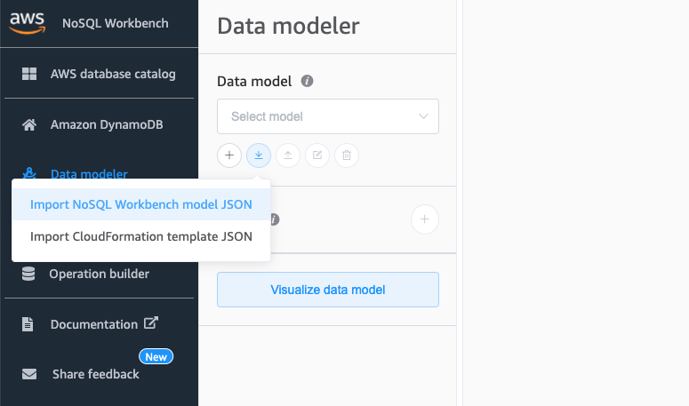
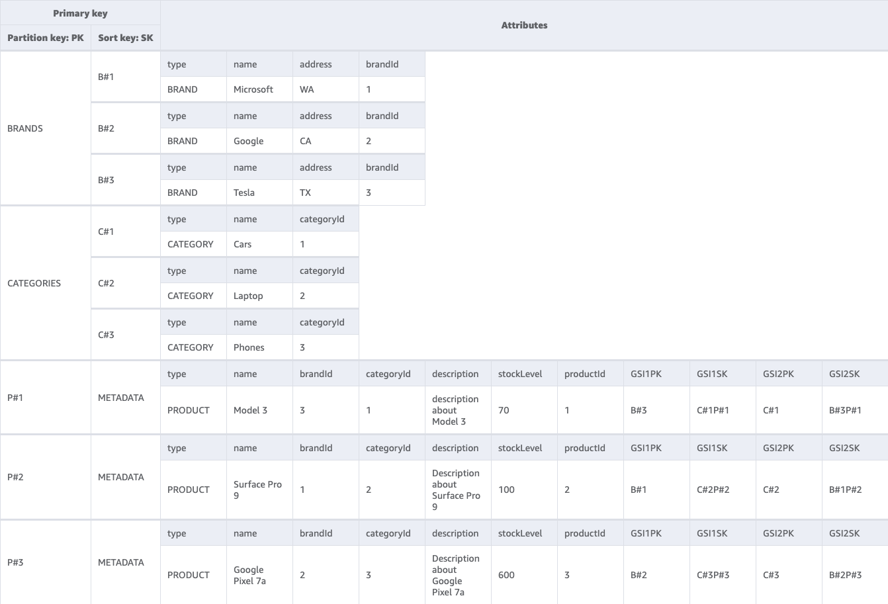
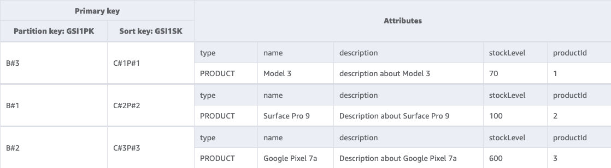

DynamoDB のモデリングを NoSQL workbench に登録したサンプルです。

## 利用方法

NoSQL workbench から product catalog model.json をインポートします。

## 表示例

ProductCatalog

GSI: GSI1

GSI: SGI2

## リファレンス

以下ページのモデリング例を参考にしています。
https://www.tecracer.com/blog/2021/03/modelling-a-product-catalog-in-dynamodb.html
